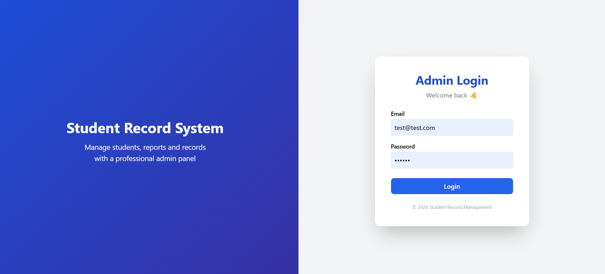
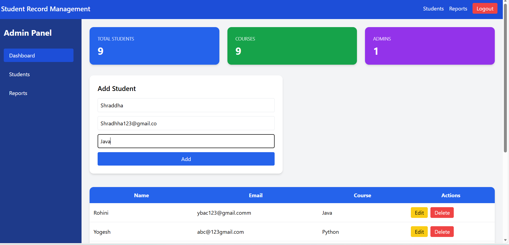
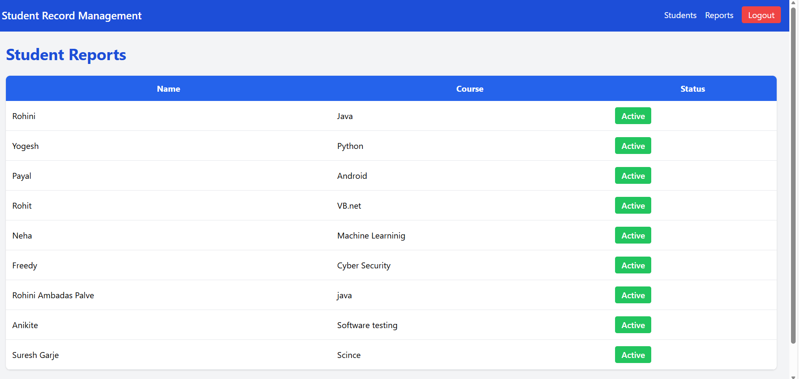

Student Record Management System

Description

Student Record Management System is a full-stack web application developed using the MERN stack (MongoDB, Express.js, React.js, Node.js).
It allows users to manage student records efficiently. Users can add, update, delete, and view student information with a user-friendly interface.

Domain

Web Development – Full Stack (MERN)

Technologies Used

MongoDB

Express.js

React.js

Node.js

JWT (for authentication)

HTML5, CSS3, JavaScript

Tools Used

VS Code

Postman

MongoDB Compass

Git & GitHub

Features

User authentication

Add, update, delete student records

View all students

Responsive frontend design

Project Setup / Instructions

Clone the repository

git clone https://github.com/rohinipalve1/student-record-management-system.git  
cd student-record-management-system  
  
Install Dependencies  
Backend  
cd backend  
npm install  
  
Frontend   
cd frontend  
npm install  
  
Set Up Environment Variables  
Create a .env file in the backend folder with:  
  
MONGO_URI=your_mongodb_connection_string  
PORT=5000  
JWT_SECRET=your_jwt_secret_key  
  
Run the Project  
Backend  
  
cd backend  
npm start  
  
  
Frontend   
  
cd frontend  
npm start  
  
Open browser: http://localhost:3000  
  
Screenshots

**Login Page**  

**Dashboard**  

**Student List Page**  

git add screenshots/ README.md
git commit -m "Add screenshots to README"
git push

Author
Rohini Palve
Email: rohinipalve137@example.com
